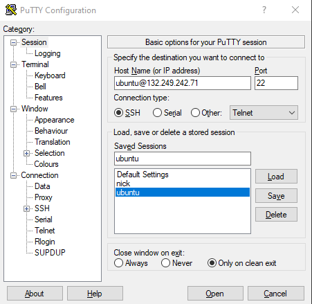
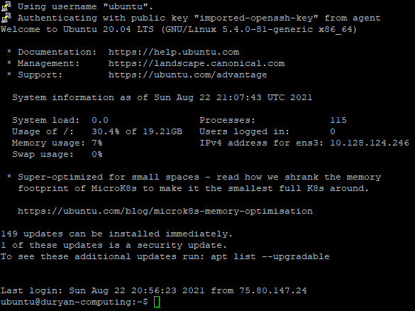
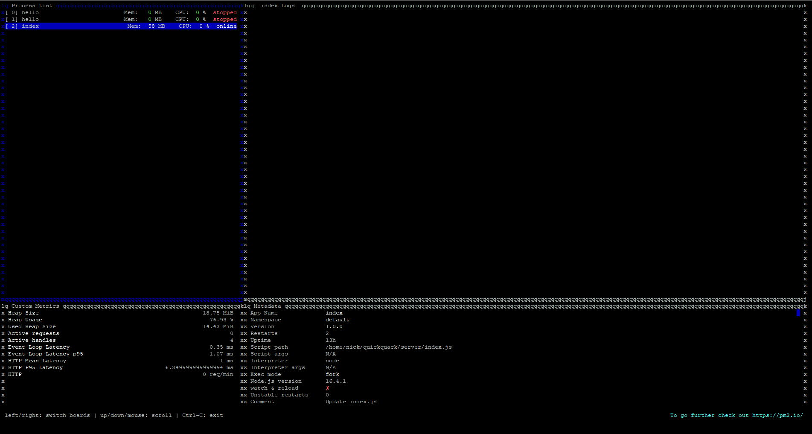

# Cloud Server Instructions

## Accessing the Server

### **PuTTY**

In order to SSH into the server, we will be using PuTTY, where you can find instructions to set it up [here](https://sdsc-ucsd.atlassian.net/wiki/spaces/SC/pages/110034995/SSH+to+Instance+using+Windows). For the private key, look in the discord, where the key is pinned in the coding-help channel under the name Duryan.pem. Here is an example of what the terminal should look like:

**Note:** You will need to have Pageant open _with_ the private key everytime you want to open the server.

This should bring up a terminal that looks something like this:

### **Navigating the terminal**

**Changing Users**

If you try to check the local files with `ls`, you might notice that the server isn't set up in this user. That's because we are logged into the root user, which doesn't have sudo access. Therefore, we needed to create another user for sudo access, and so we have another user you will need to access.

In order to access the other user, run the command `su nick` in order to access nick's user. The password is `password123`. Then, do `cd ~` to find the folder we are working in.

**Viewing Server Activity**

At this point, you will be in the user where we setup our node server. In order to have our server running even while we are not SSH'ed into it, we used a package called `pm2`.

To briefly view the server status, you can type in `pm2 list`. Our server is called index, as the script our server runs on is called index.js.

To monitor the server's activity, input the command `pm2 monit` and navigate down to index. You should get a screen like this:

**Note:** Any console.log messages will appear in the index Logs square on the right half of the screen.

**Accessing Postgres Database**

In order to interact with postgres, we will need to change to the postgres user. This can be done by running the following command:

`sudo -u postgres psql`

**Note:** Make sure to navigate to our database by running `\c main`.

**Note:** Quitting postgres with `\q` will lead you back to the ubuntu repository. In order to get back to nick's repository, run the command `cd ../nick`

### Copying files into the server

[Here](https://help.ubuntu.com/community/SSH/TransferFiles) is a reference for how to transfer files over SSH.
